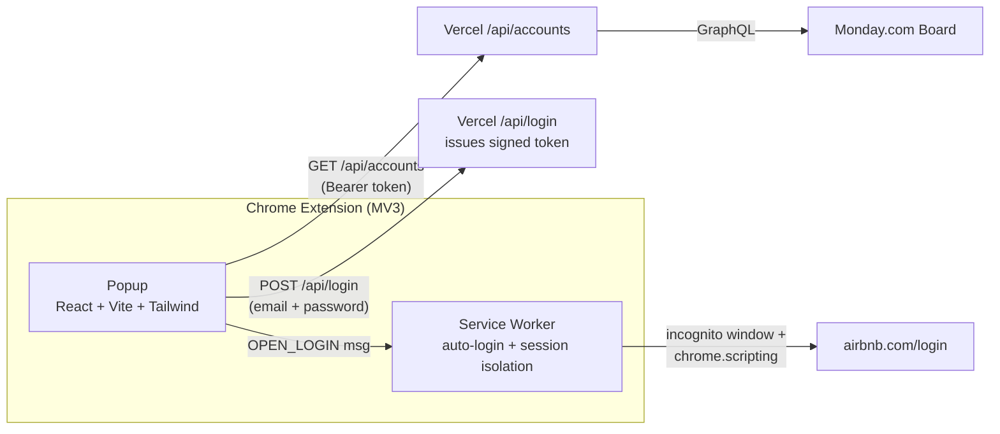

# WEHOST – Airbnb Accounts Manager

A Chrome (Manifest V3) extension that lets WeHost property managers view their roster of
Airbnb host accounts and **auto-login to any of them in a clean, isolated incognito
session** — one click, no manual typing, no leftover sessions bleeding between accounts.


> **Note:** This repository is public for portfolio purposes. The code is proprietary —
> see [LICENSE](LICENSE).

<p align="center">
  
</p>

## Features

- **Per-user sign-in** — access is gated behind an email/password login validated
  server-side; credentials are never released to an unauthenticated client.
- **One-click auto-login** — pick an account and the extension opens a fresh incognito
  window and drives the Airbnb login form end-to-end.
- **Clean session isolation** — before each login it wipes all Airbnb cookies and tears
  down the incognito profile, so no remembered email or session survives between accounts.
- **Search & city filter** — quickly find an account by email or property name, filter by city.
- **Favorites & drag-to-reorder** — pin the accounts you use most and arrange them in your
  own order; favorites stay grouped at the top. Order persists locally.
- **Copy email / password** to clipboard with one tap.
- **On-demand sync** — account data is pulled from the team's Monday.com board only when
  you press Sync; nothing runs in the background.

## Architecture



- **Popup** gates the UI behind a login, then talks to the Vercel proxy with a session
  token (the Monday.com token never touches the client).
- **`/api/login`** ([`api/login.js`](api/login.js)) validates credentials against a hashed
  allowlist and issues a signed, expiring token.
- **`/api/accounts`** ([`api/accounts.js`](api/accounts.js)) requires a valid token, then
  queries Monday.com and returns a de-duplicated, grouped account list. A `test`-role token
  receives synthetic demo data only.
- **Service worker** ([`src/background/service_worker.js`](src/background/service_worker.js))
  handles the login automation and incognito session lifecycle.

## Engineering highlights

A few parts that were more interesting than they look:

- **Two-pass Vite build for MV3.** MV3 service workers must be a single self-contained
  IIFE, but the popup is a normal ESM React app. The build runs Vite twice — once for the
  popup, once (`BUILD_TARGET=sw`) for the worker as an IIFE library. See
  [`vite.config.js`](vite.config.js).
- **Resilient auto-login.** Airbnb ships multiple login UIs (old vs. 2024+), and some
  accounts hit a "Confirm it's you" challenge instead of a password field. The injected
  script detects the variant, waits on selectors/text, and routes through the challenge
  ("Try another way" → password) when needed.
- **True session isolation.** Rather than navigating to `/logout` (which fails silently
  when CSRF tokens are missing), the worker deletes Airbnb cookies directly from the
  incognito cookie store and destroys the profile by closing its last window.
- **Grouped drag-to-reorder.** Custom ordering is stored as a flat email list in
  `chrome.storage.local`; sort keeps favorites grouped while honoring the user's order
  within each group, and new accounts append to the end after a sync.

## Tech stack

| Layer | Tech |
|---|---|
| UI | React 18, Vite 6, Tailwind CSS 3 |
| Extension | Chrome Manifest V3 (popup + service worker) |
| Backend | Vercel Serverless Functions |
| Data source | Monday.com GraphQL API |

## Project structure

```
├── api/
│   ├── login.js                    # Validates credentials, issues a signed token
│   ├── accounts.js                 # Token-gated proxy → Monday.com (test role = demo data)
│   └── _lib/auth.js                # Token sign/verify, password hashing, CORS, rate limit
├── public/
│   ├── manifest.json               # MV3 manifest
│   └── icons/                      # Generated extension icons
├── popup.html                      # Popup entry
├── src/
│   ├── App.jsx                     # Login gate + popup shell, filtering, drag-reorder
│   ├── components/                 # LoginScreen, AccountCard, SearchBar, FilterBar, SyncBar
│   ├── hooks/                      # useAuth (login/token), useAccounts (sync + state)
│   └── background/service_worker.js # Auto-login + session isolation
├── scripts/                        # create-icons, create-promo, hash-user, make-auth-users
├── vite.config.js                  # Two-pass build (popup ESM + worker IIFE)
└── vercel.json
```

## Setup

```bash
npm install
cp .env.example .env   # then fill in the values
```

Environment variables:

| Variable | Where | Purpose |
|---|---|---|
| `VITE_API_BASE_URL` | `.env` (build-time) | Base URL of the Vercel proxy |
| `VITE_EXTENSION_API_KEY` | `.env` (build-time) | First-factor key the extension sends to the proxy |
| `EXTENSION_API_KEY` | Vercel dashboard | First-factor key the proxy validates against |
| `MONDAY_API_TOKEN` | Vercel dashboard | Monday.com API token (server-side only) |
| `MONDAY_BOARD_ID` | Vercel dashboard | Monday.com board to read from |
| `AUTH_USERS` | Vercel dashboard | JSON allowlist of `{ email, hash, role }` logins |
| `AUTH_PEPPER` | Vercel dashboard | Server-only secret mixed into password hashes |
| `AUTH_JWT_SECRET` | Vercel dashboard | Secret used to sign/verify session tokens |

Manage logins with `node scripts/make-auth-users.js "email:password[:role]" ...` to produce
the `AUTH_USERS` value.

## Development & build

```bash
npm run dev      # Vite dev server (popup only)
npm run build    # Two-pass production build → dist/
```

### Load the extension

1. `npm run build`
2. Open `chrome://extensions`, enable **Developer mode**
3. **Load unpacked** → select the `dist/` folder

## Security

Account data is released only to authenticated, allowlisted users:

- **Per-user authentication is the real access gate.** `/api/accounts` requires a valid,
  signed session token — not just the bundled key. A user obtains a token by logging in
  through `/api/login`, which validates the email/password against a server-side hashed
  allowlist (`AUTH_USERS`). This means a key extracted from the shipped bundle is **not**
  sufficient to read data: without a valid login the endpoint returns `401`.
- **Test mode for review.** A `test`-role login receives only synthetic demo data, so the
  Chrome Web Store reviewer can verify the extension without ever receiving real credentials.
- **Secrets stay server-side.** The Monday.com token/board ID and all auth secrets
  (`AUTH_PEPPER`, `AUTH_JWT_SECRET`) live only in Vercel environment variables.
- **Defense in depth.** Passwords are stored salted-and-hashed (never plaintext); tokens are
  HMAC-signed with a 30-day expiry; the proxy uses constant-time comparisons, restricts CORS
  to the extension origin, sends `Cache-Control: no-store`, and applies best-effort rate
  limiting (move to Vercel KV / Upstash for robust global limiting).
- **Revocation.** Removing a user from `AUTH_USERS` (and redeploying) revokes their access;
  rotating `AUTH_JWT_SECRET` invalidates all existing tokens at once.

## License

Proprietary — All Rights Reserved. See [LICENSE](LICENSE).
